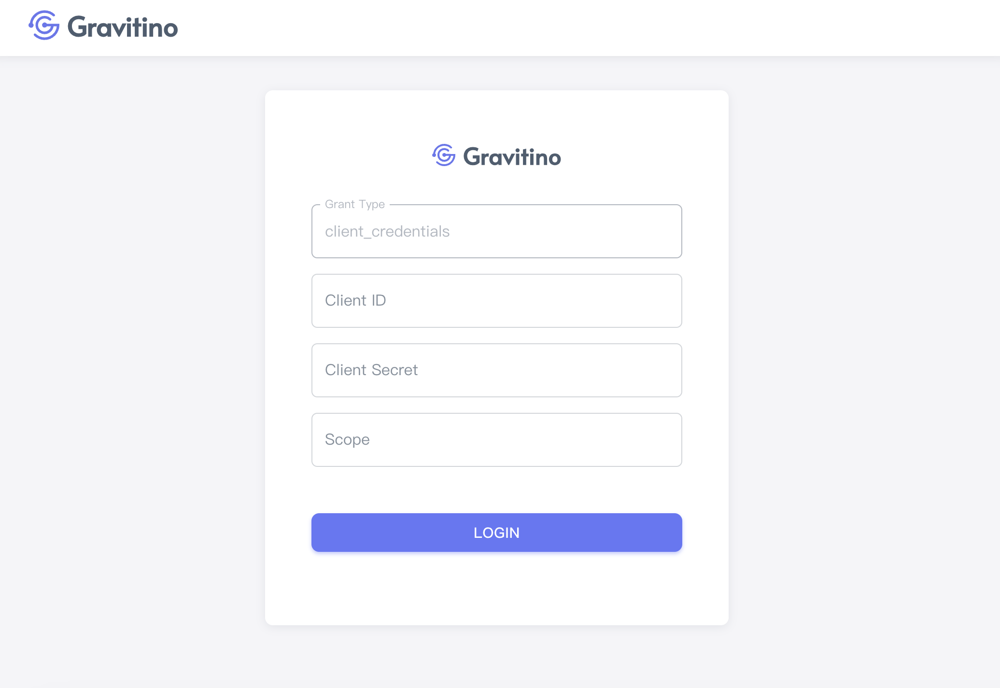
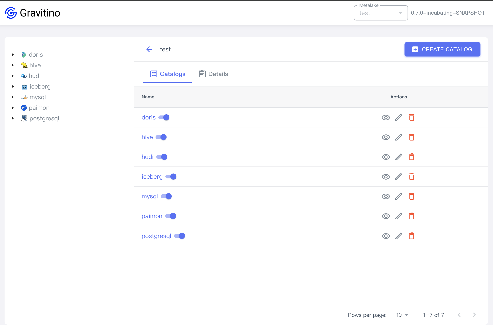

> A graphical interface accessible through a web browser.

Complete the installation, and open the browser [http://localhost:8090](http://localhost:8090).

## Initial page

The webUI homepage displaying in Gravitino depends on the configuration parameter for OAuth mode, see the details in [Security](security.md).

Set parameter for `gravitino.authenticator`, [`simple`](#simple-mode) or [`oauth`](#oauth-mode).

:::caution
After the configuration change, make sure to restart the gravitino server.
:::

### Simple mode

```
gravitino.authenticator = simple
```

If the configuration parameter for `gravitino.authenticator` is set to `simple`, the webUI will directly display the homepage (Metalakes).


At the top-right, the current version is displayed.

The main content displays a created metalake list.

### Oauth mode

```
gravitino.authenticator = oauth
```

If the configuration parameter for `gravitino.authenticator` is set to `oauth`, the webUI will directly display the login page.



1. Follow the [example steps](security#example), enter the following values in these text fields.

- Client ID: `test`
- Client Secret: `test`
- Scope: `test`

2. Clicking on the `LOGIN` button to verify redirection to the homepage.


At the top-right, there is an extra icon button that redirects to the login page when clicked.

## Manage metadata

> All the manage actions are from [REST API](api/rest/gravitino-rest-api)

### Metalake

#### [Create a metalake](getting-started#using-rest-to-interact-with-gravitino)

On the homepage, clicking the `CREATE METALAKE` button will display a dialog to create a metalake.


Create a metalake needs these fields:

1. **Name**(**_required_**): the metalake name, It's best to use only English letters, and avoid using special characters like _space_.
2. **Comment**(_optional_): the comment of this metalake
3. **Properties**(_optional_): clicking on the `ADD PROPERTY` button to add custom properties


Each metalake consists of three actions.


#### 1. Show metalake details


#### 2. Edit metalake

Displays a dialog for modifying fields.


#### 3. Delete metalake

Display a confirmation dialog, clicking `SUBMIT` will delete this metalake.


### Catalog

Clicking on `test`(metalake_name) on the table to view catalogs in a metake.

In the first time, It shows no data until create a catalog.


Clicking on the Tab - `DETAILS` to view this metalake details in metalake catalogs page.


#### Create a catalog

Clicking on the `CREATE CATALOG` button will displaying a dialog to create a catalog.


Create a catalog needs these fields:

1. **Catalog name**(**_required_**): the catalog name of this metalke
2. **Type**(**_required_**): the default value is `relational`,
3. **Provider**(**_required_**): `hive`/`iceberg`/`mysql`/`postgresql`
4. **Comment**(_optional_): the comment of this catalog
5. **Properties**(**specific provider inculdes required fileds**)

##### Providers

> Required properties in various providers

- hive

Following: [Apache Hive catalog](apache-hive-catalog)


|Key           |Description                                           |
|--------------|------------------------------------------------------|
|metastore.uris|The Hive metastore URIs e.g. `thrift://127.0.0.1:9083`|

- iceberg

Following: [Lakehouse Iceberg catalog](lakehouse-iceberg-catalog)

|Key            |Description      |
|---------------|-----------------|
|catalog-backend|`hive`, or `jdbc`|

  - `hive`

  

  |Key      |Description                     |
  |---------|--------------------------------|
  |uri      |Iceberg catalog uri config      |
  |warehouse|Iceberg catalog warehouse config|

  - `jdbc`

  

  |Key          |Description                                                                                            |
  |-------------|-------------------------------------------------------------------------------------------------------|
  |uri          |Iceberg catalog uri config                                                                             |
  |warehouse    |Iceberg catalog warehouse config                                                                       |
  |jdbc-driver  |"com.mysql.jdbc.Driver" or "com.mysql.cj.jdbc.Driver" for MySQL, "org.postgresql.Driver" for PostgreSQL|
  |jdbc-user    |jdbc username                                                                                          |
  |jdbc-password|jdbc password                                                                                          |

- mysql

Following: [JDBC MySQL catalog](jdbc-mysql-catalog)


|Key          |Description                                                                                        |
|-------------|---------------------------------------------------------------------------------------------------|
|jdbc-driver  |JDBC URL for connecting to the database. e.g. `com.mysql.jdbc.Driver` or `com.mysql.cj.jdbc.Driver`|
|jdbc-url     |e.g. `jdbc:mysql://localhost:3306`                                                                 |
|jdbc-user    |The JDBC user name                                                                                 |
|jdbc-password|The JDBC password                                                                                  |

- postgresql


|Key          |Description                                          |
|-------------|-----------------------------------------------------|
|jdbc-driver  |e.g. `e.g. org.postgresql.Driver`                    |
|jdbc-url     |e.g. `jdbc:postgresql://localhost:5432/your_database`|
|jdbc-user    |The JDBC user name                                   |
|jdbc-password|The JDBC password                                    |
|jdbc-database|e.g. `pg_database`                                   |

After vertified inputing these fields, clicking on the `CREATE` button to creates a catalog.



Clicking the icon button - `←(left arrow)` will redirect to metalake page.

### Schema

Under Construction...

### Table

Under Construction...
