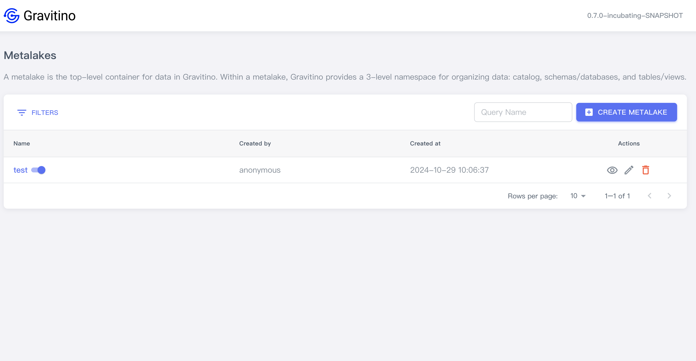
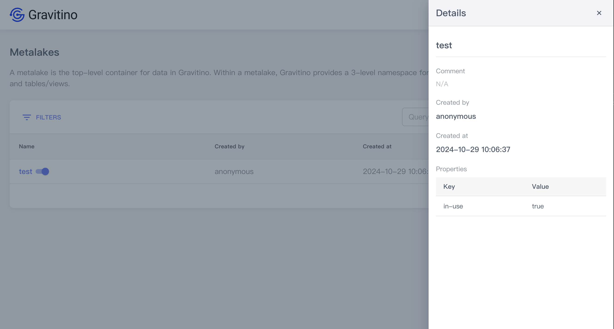
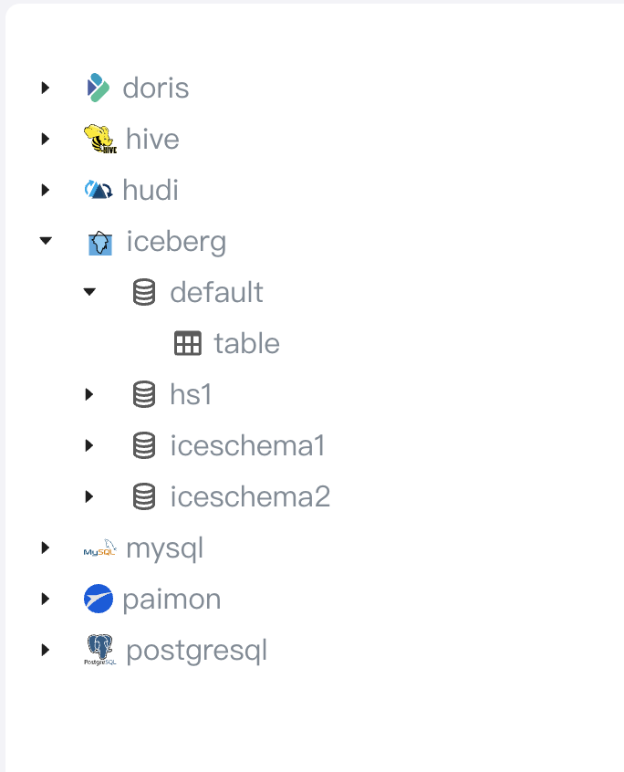
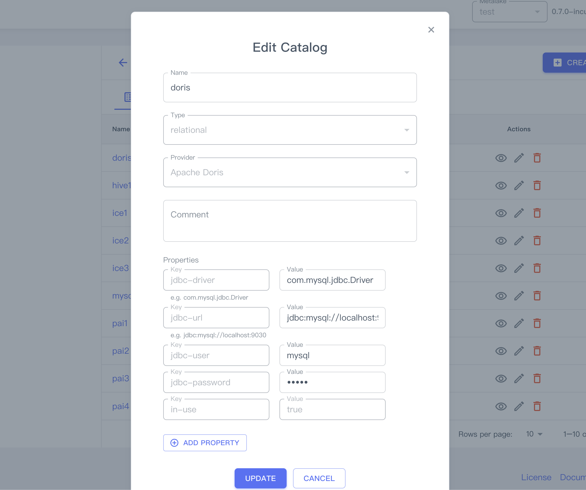
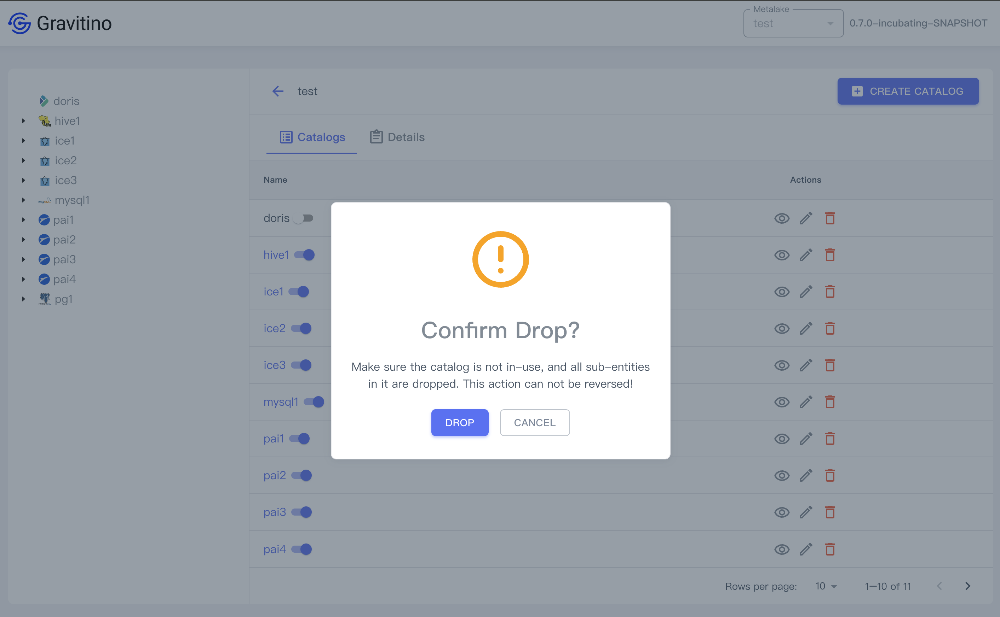

import Image from '@theme/IdealImage'
import Tabs from '@theme/Tabs'
import TabItem from '@theme/TabItem'

This document primarily outlines how users can manage metadata within Gravitino using the web UI, the graphical interface is accessible through a web browser as an alternative to writing code or using the REST interface.

Currently, you can integrate [OAuth settings](security.md) to view, add, modify, and delete metalakes, create catalogs, and view catalogs, schemas, and tables, among other functions.

[Build](how-to-build.md#quick-start) and [deploy](getting-started.md#getting-started-locally) the Gravitino Web UI and open it in a browser at `http://<gravitino-host>:<gravitino-port>`, by default is [http://localhost:8090](http://localhost:8090).

## Initial page

The web UI homepage displayed in Gravitino depends on the configuration parameter for OAuth mode, see the details in [Security](security.md).

Set parameter for `gravitino.authenticator`, [`simple`](#simple-mode) or [`oauth`](#oauth-mode). Simple mode is the default authentication option.

:::tip
After changing the configuration, make sure to restart the Gravitino server.

`<path-to-gravitino>/bin/gravitino.sh restart`
:::

### Simple mode

```text
gravitino.authenticator = simple
```

Set the configuration parameter `gravitino.authenticator` to `simple`, and the web UI displays the homepage (Metalakes).


At the top-right, the UI displays the current Gravitino version.

The main content displays the existing metalake list.

### Oauth mode

```text
gravitino.authenticator = oauth
```

Set the configuration parameter `gravitino.authenticator` to `oauth`, and the web UI displays the login page.


1. Enter the values corresponding to your specific configuration. For detailed instructions, please refer to [Security](security.md).

2. Clicking on the `LOGIN` button takes you to the homepage.


At the top-right, there is an icon button that takes you to the login page when clicked.

## Manage metadata

> All the manage actions are performed by using the [REST API](api/rest/gravitino-rest-api)

### Metalake

#### [Create metalake](getting-started.md#using-rest-to-interact-with-gravitino)

On the homepage, clicking on the `CREATE METALAKE` button displays a dialog to create a metalake.


Creating a metalake needs these fields:

1. **Name**(**_required_**): the name of the metalake.
2. **Comment**(_optional_): the comment of the metalake.
3. **Properties**(_optional_): Click on the `ADD PROPERTY` button to add custom properties.



There are 3 actions you can perform on a metalake.


#### Show metalake details

Clicking on the action icon <Icon icon='bx:show-alt' fontSize='24' /> in the table cell.

You can see the detailed information of this metalake in the drawer component on the right.



#### Edit metalake

Clicking on the action icon <Icon icon='mdi:square-edit-outline' fontSize='24' /> in the table cell.

Displays the dialog for modifying fields of the selected metalake.


#### Delete metalake

Clicking on the action icon <Icon icon='mdi:delete-outline' fontSize='24' color='red' /> in the table cell.

Displays a confirmation dialog, clicking on the `SUBMIT` button deletes this metalake.


### Catalog

Clicking on a metalake name in the table views catalogs in a metalake.

If this is the first time, it shows no data until after creating a catalog.

Clicking on the left arrow icon button <Icon icon='mdi:arrow-left' fontSize='24' color='#6877ef' /> takes you to the metalake page.


Clicking on the Tab - `DETAILS` views the details of the catalog on the metalake catalogs page.


On the left side of the page is a tree list.

- Catalog <Icon icon='bx:book' fontSize='24px' />
- Schema <Icon icon='bx:coin-stack' fontSize='24px' />
- Table <Icon icon='bx:table' fontSize='24px' />



Hover your mouse over the corresponding icon to the data changes to a reload icon <Icon icon='mdi:reload' fontSize='24px' />. Click on this icon to reload the currently selected data.


#### Create catalog

Clicking on the `CREATE CATALOG` button displays the dialog to create a catalog.


Creating a catalog requires these fields:

1. **Catalog name**(**_required_**): the name of the catalog
2. **Type**(**_required_**): the default value is `relational`
3. **Provider**(**_required_**): `hive`/`iceberg`/`mysql`/`postgresql`
4. **Comment**(_optional_): the comment of this catalog
5. **Properties**(**each `provider` must fill in the required property fields specifically**)

##### Providers

> Required properties in various providers

<Tabs>
  <TabItem value='hive' label='Hive'>
    Follow the [Apache Hive catalog](apache-hive-catalog) document

    <Image img={require('./assets/webui/props-hive.png')} style={{ width: 480 }} />

    |Key           |Description                                           |
    |--------------|------------------------------------------------------|
    |metastore.uris|The Hive metastore URIs e.g. `thrift://127.0.0.1:9083`|

  </TabItem>
  <TabItem value='iceberg' label='Iceberg'>
    Follow the [Lakehouse Iceberg catalog](lakehouse-iceberg-catalog) document

    the parameter `catalog-backend` provides two values: `hive`, and `jdbc`.

    |Key            |Description      |
    |---------------|-----------------|
    |catalog-backend|`hive`, or `jdbc`|

    - `hive`

    <Image img={require('./assets/webui/props-iceberg-hive.png')} style={{ width: 480 }} />

    |Key      |Description                     |
    |---------|--------------------------------|
    |uri      |Iceberg catalog URI config      |
    |warehouse|Iceberg catalog warehouse config|

    - `jdbc`

    <Image img={require('./assets/webui/props-iceberg-jdbc.png')} style={{ width: 480 }} />

    |Key          |Description                                                                                            |
    |-------------|-------------------------------------------------------------------------------------------------------|
    |uri          |Iceberg catalog URI config                                                                             |
    |warehouse    |Iceberg catalog warehouse config                                                                       |
    |jdbc-driver  |"com.mysql.jdbc.Driver" or "com.mysql.cj.jdbc.Driver" for MySQL, "org.postgresql.Driver" for PostgreSQL|
    |jdbc-user    |jdbc username                                                                                          |
    |jdbc-password|jdbc password                                                                                          |

  </TabItem>
  <TabItem value='mysql' label='MySQL'>
    Follow the [JDBC MySQL catalog](jdbc-mysql-catalog) document

    <Image img={require('./assets/webui/props-mysql.png')} style={{ width: 480 }} />

    |Key          |Description                                                                                        |
    |-------------|---------------------------------------------------------------------------------------------------|
    |jdbc-driver  |JDBC URL for connecting to the database. e.g. `com.mysql.jdbc.Driver` or `com.mysql.cj.jdbc.Driver`|
    |jdbc-url     |e.g. `jdbc:mysql://localhost:3306`                                                                 |
    |jdbc-user    |The JDBC user name                                                                                 |
    |jdbc-password|The JDBC password                                                                                  |

  </TabItem>
  <TabItem value='postgresql' label='PostgreSQL'>
    Follow the [JDBC PostgreSQL catalog](jdbc-postgresql-catalog) document

    <Image img={require('./assets/webui/props-pg.png')} style={{ width: 480 }} />

    |Key          |Description                                          |
    |-------------|-----------------------------------------------------|
    |jdbc-driver  |e.g. `org.postgresql.Driver`                    |
    |jdbc-url     |e.g. `jdbc:postgresql://localhost:5432/your_database`|
    |jdbc-user    |The JDBC user name                                   |
    |jdbc-password|The JDBC password                                    |
    |jdbc-database|e.g. `pg_database`                                   |

  </TabItem>
</Tabs>

After verifying the values of these fields, clicking on the `CREATE` button creates a catalog.


#### Show catalog details

Clicking on the action icon <Icon icon='bx:show-alt' fontSize='24' /> in the table cell.

You can see the detailed information of this catalog in the drawer component on the right.


#### Edit catalog

Clicking on the action icon <Icon icon='mdi:square-edit-outline' fontSize='24' /> in the table cell.

Displays the dialog for modifying fields of the selected catalog.



Only the `name`, `comment`, and custom fields in `properties` can be modified, other fields such as `type`, `provider`, and default fields in `properties` cannot be modified.

The fields that are not allowed to be modified cannot be selected and modified in the web UI.

#### Delete catalog

Clicking on the action icon <Icon icon='mdi:delete-outline' fontSize='24' color='red' /> in the table cell.

Displays a confirmation dialog, clicking on the SUBMIT button deletes this catalog.



### Schema

Under Construction...

- [x] View
- [ ] Create
- [ ] Edit
- [ ] Delete

Design draft preview:


### Table

Under Construction...

- [x] View
- [ ] Create
- [ ] Edit
- [ ] Delete

Design draft preview:


## Feature capabilities

| Page     | Capabilities                                                                      |
| -------- | --------------------------------------------------------------------------------- |
| Metalake | _`View`_ &#10004; / _`Create`_ &#10004; / _`Edit`_ &#10004; / _`Delete`_ &#10004; |
| Catalog  | _`View`_ &#10004; / _`Create`_ &#10004; / _`Edit`_ &#10004; / _`Delete`_ &#10004; |
| Schema   | _`View`_ &#10004; / _`Create`_ &#10008; / _`Edit`_ &#10008; / _`Delete`_ &#10008; |
| Table    | _`View`_ &#10004; / _`Create`_ &#10008; / _`Edit`_ &#10008; / _`Delete`_ &#10008; |

## E2E test
End-to-end testing for web frontends is conducted using the [Selenium](https://www.selenium.dev/documentation/) testing framework, which is Java-based.

Test cases can be found in the project directory: `integration-test/src/test/java/com/datastrato/gravitino/integration/test/web/ui`, where the `pages` directory is designated for storing definitions of frontend elements, among others.
The root directory contains the actual steps for the test cases.

:::tip
 While writing test cases, running them in a local environment may not pose any issues.

 However, due to the limited performance capabilities of GitHub Actions, scenarios involving delayed DOM loading—such as the time taken for a popup animation to open—can result in test failures.

 To circumvent this issue, it is necessary to manually insert a delay operation, for instance, by adding such as `Thread.sleep(sleepTimeMillis)`.

 This ensures that the test waits for the completion of the delay animation before proceeding with the next operation, thereby avoiding the problem.

 It is advisable to utilize the [`waits`](https://www.selenium.dev/documentation/webdriver/waits/) methods inherent to Selenium as a substitute for `Thread.sleep()`.
:::
