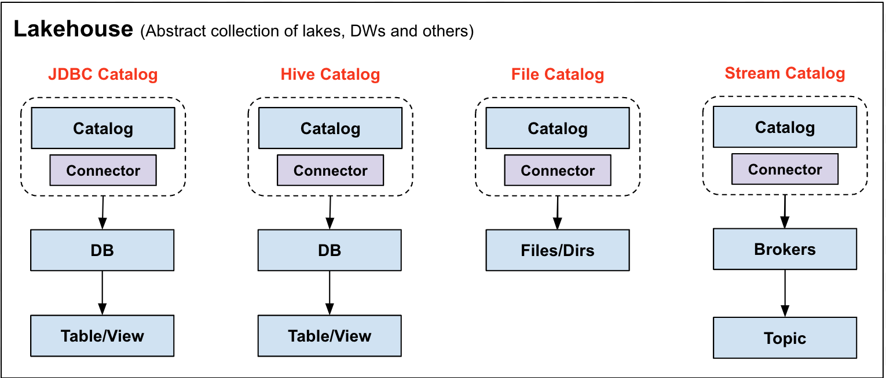

<!--
  Copyright 2023 Datastrato Pvt Ltd.
  This software is licensed under the Apache License version 2.
-->
# RFC-1: Metadata Spec Design

| Revision | Owner      |
| :------- | ---------- |
| v0.1     | Jerry Shao |
| v0.2     | Jerry Shao |

## Design Prerequisites

1. The metadata spec should be evolved, backward compatible, and possibly forward compatible (If possible and necessary).
2. The on-wire protocol (user-faced interface) should be readable and debuggable by mainstream web-based tools.
3. The storage layout should be concise and performant, also be backward compatible.
4. The type and schema system should be generic enough to cover mainstream db/dws/dl’s schema system.
5. The schema can be evolved to support non-table datasets (stream, model).
6. The schema should be evolved to support Hive’s schema spec, so we could replace HMS later on.

## Design choices

1. We choose JSON protocol as our user-faced protocol, which is easy to debug for users and systems.
2. We choose Protobuf binary layout to store the schema, the main considerations are here:
    1. Binary layout is much more concise compared to HMS’s schema layout.
    2. A general-purpose NoSQL database can be used to store the schema, which will get better performance and scalability compared to Hive Metastore.

## Meta System

### Prerequisites

1. The field name of schema should use lowercase with "_" connecting different words, the name convention is `^[a-z](?:_?[a-z0-9]+)*$`.
2. The schema system uses Google Protobuf to describe the structs.

### Schema Entities

The schema system in Gravitino is organized like below:

1. **Metalake**: metalake is a top-level container that manages all the metadata from DB/EDW, Hive/Iceberg/Hudi, plain files, MQ and others.
2. **Catalog**: catalog is a collection of metadata from a specific metadata source. For example, “hive.db.table” means this table belongs to Hive catalog under the DB “db”.
3. **Connector**: connector is 1 to 1 mapping to catalog, 1 connector is binding to 1 catalog, and 1 catalog only has 1 connector. The connector defines how to connect the underlying metadata source.
4. **Metadata Structure**: metadata structure is defined per metadata source. For example, JDBC and Hive catalog follow “db.table” pattern, file catalog follows “scheme:///<file_path>” pattern.

#### SchemaVersion

| Field Name    | Field Type | Description                                                  | Optional |
| ------------- | ---------- | ------------------------------------------------------------ | -------- |
| major_version | uint32     | The major version of the schema system. Backward compatibility is guaranteed within the major version and is best-effort guaranteed between versions. | Required |
| minor_version | uint32     | The minor version of the schema system. Backward compatibility is guaranteed between versions | Required |

#### AuditInfo

| Field Name         | Field Type | Description                                                  | Optional |
| ------------------ | ---------- | ------------------------------------------------------------ | -------- |
| creator            | string     | The name of user who creates the schema entity               | Required |
| create_time        | timestamp  | Google Protobuf timestamp type to represent when entity is created | Required |
| last_modifier      | string     | The name of user who modified the schema entity last time    | Optional |
| last_modified_time | timestamp  | Google Protobuf timestamp type to represent when entity is modified | Optional |

#### Metalake

| Field Name | Field Type          | Description                                                  | Optional |
| ---------- | ------------------- | ------------------------------------------------------------ | -------- |
| id         | uint64              | The unique identifier of the metalake, this is generated by the system | Required |
| name       | string              | The name of the metalake                                    | Required |
| comment    | string              | The comment of the metalake                                 | Optional |
| properties | map<string, string> | The properties of the metalake                              | Optional |
| audit_info | AuditInfo           | The detailed audit info of metalake                         | Required |
| version    | SchemaVersion       | The version info of the stored schema                        | Required |

#### Catalog

| Field Name   | Field Type                             | Description                                                  | Optional |
| ------------ | -------------------------------------- | ------------------------------------------------------------ | -------- |
| id           | uint64                                 | The unique identifier of the catalog, this is generated by the system | Required |
| metalake_id | uint64                                 | The unique identifier of the metalake which includes this catalog | Required |
| name         | string                                 | The name of the catalog                                      | Required |
| comment      | string                                 | The comment of the catalog                                   | Required |
| type         | Enum of {RELATIONAL, FILE, STREAM, ML} | The type of the catalog, currently we support is "RELATIONAL" (catalog for relational data structure) | Required |
| properties   | map<string, string>                    | The properties of the catalog                                | Optional |
| audit_info   | AuditInfo                              | The audit info of the catalog                                | Required |

##### Catalog for relational data structure

The relational data structure referrers data stored in DB or DWS, and organized hierarchically like `db.table` or `a.b.c`. With such metadata, we defined several catalog interfaces to support manipulating relational metadata.

* **BaseCatalog**: `BaseCatalog` is the base class for catalog, the implementation should inherit it to implement its own.
* **SupportNamespaces**: `SupportNamespaces` provides the APIs to create structured metadata, like `Database`.
* **TableCatalog**: `TableCatalog` defines the APIs to manipulate `Table` and it's `Column` entities. The specific `TableCatalog` implementation should also implement `Table` and `Column` to satisfy the specific underlying metadata source.
