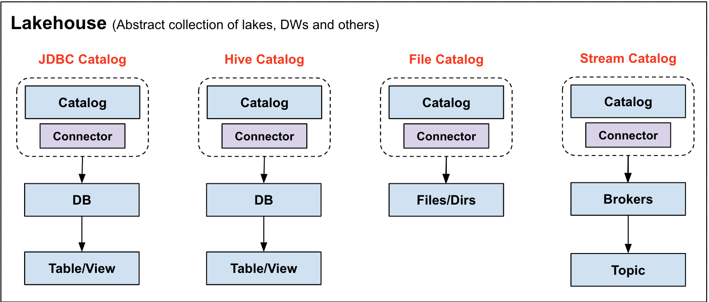

<!--
  Licensed to the Apache Software Foundation (ASF) under one
  or more contributor license agreements.  See the NOTICE file
  distributed with this work for additional information
  regarding copyright ownership.  The ASF licenses this file
  to you under the Apache License, Version 2.0 (the
  "License"); you may not use this file except in compliance
  with the License.  You may obtain a copy of the License at

   http://www.apache.org/licenses/LICENSE-2.0

  Unless required by applicable law or agreed to in writing,
  software distributed under the License is distributed on an
  "AS IS" BASIS, WITHOUT WARRANTIES OR CONDITIONS OF ANY
  KIND, either express or implied.  See the License for the
  specific language governing permissions and limitations
  under the License.
-->

# RFC-1: Entity Key Encoding design for KV store (removed)

| Revision | Owner |  Date |
| :------- |-------| ------|
| v0.1     | Qi Yu | 1/8/2023|
| v0.2     | Qi Yu | 5/9/2023|

## ❌️ REMOVED

Removed KV store on: 2024-12

This document is no longer maintained and may contain outdated information.

## Background
Currently, there will be many data to storage, for example, 
User information. Such as username, password, user property, this data is structure data
Metadata. Metadata is the key point of our product. Metadata is Heterogeneous and data may be very large
Other information, such as query history, query log and so on

To store this information, there will be 3 kinds of databases to store, that is
Relational database
KV Store
GraphDB
Others like MongoDB, ES

After we refer to snowflake schema and others (Hashdata and so on), KV storage is better than other kinds of storage compared to relational databases.

According to our previous design, Metadata in gravitino will be organized as the following structure


According to the picture above, Metadata in gravitino can be divided into multiple layers which is a little bit like a file directory structure. To implement this hierarchy, we can choose the following options to encode keys.

## Design

### Target

We should design a key encoding method to encode the key of KV store that should satisfy the following requirements:
- Support fast point queries 
- Support efficient range queries
- Not very complicated 
- Good expandability and compatibility


### Design 

Firstly, we introduce a global auto-increment ID (or simply a UUID) that represents the name of namespace. This ID is unique in the whole system. 
For example, if there exists a catalog named `catalog1` with namespace name `metalake1`, and a schema name `schema3` under `catalog2`, then we will add the following key-value pair to KV store

| Key         | Value       | Description                                  | 
|:------------|-------------|----------------------------------------------|
| metalake1   | 1           | name to id mapping,                          |
| 1/catalog2  | 2           | name to id mapping, 1 is the id of metalake1 |
| 1/2/schema3 | 3           | name to id mapping, 2 is the id of catalog2  |
| 1           | metalake1   | id to name mapping                           |
| 2           | 1/catalog2  | id to name mapping                           |
| 3           | 1/2/schema3 | id to name mapping                           |

Note, for `catalog` and `makelake`, Considering the global uniqueness, we will use a UUID instead of auto-increment ID.
`schema`, `table` and other entities will use auto-increment ID.


Why we introduce this global auto-increment ID? Because we want to support the following features:
- If we want to rename a namespace, we can just update the name to id mapping
- If the name is too long, we can use a short name to represent it when encoding key of entity (see below)

Then, The whole key of entity can be encoded as the following format


| Key                                            | Value         | Description                     | 
|:-----------------------------------------------|---------------|---------------------------------|
| ml/{ml_id}                                     | metalake info | ml is a short name for metalake |
| ml/{ml_id}                                     | metalake info | ml is a short name for metalake |
| ca/{ml_id}/{ca_id}                             | catalog_info  | ca is a short name for catalog  |
| ca/{ml_id}/{ca_id}                             | catalog_info  | ca is a short name for catalog  |
| sc/{ml_id}/{ca_id}/{sc_id}                     | schema_info   | sc is a short name for schema   |
| sc/{ml_id}/{ca_id}/{sc_id}                     | schema_info   | sc is a short name for schema   |
| br/{ml_id}/{ca_id}/{br_id}                     | broker_info   | br is a short name for broker   |
| br/{ml_id}/{ca_id}/{br_id}                     | broker_info   | br is a short name for broker   |
| ta/{ml_id}/{catalog_id}/{schema_id}/{table_id} | table_info    | ta is a short name for table    |
| to/{ml_id}/{catalog_id}/{br_id}/{topic_id}     | topic_info    | to is a short name for topic    |

## Implementation

Please see code ```BinaryEntityKeyEncoder```


