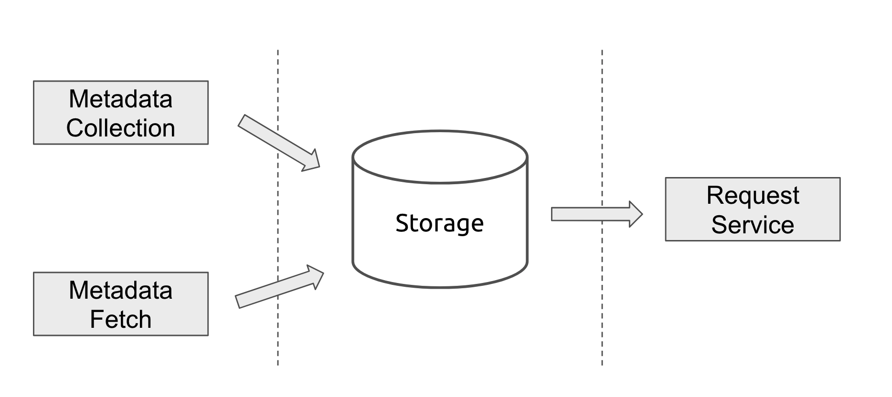
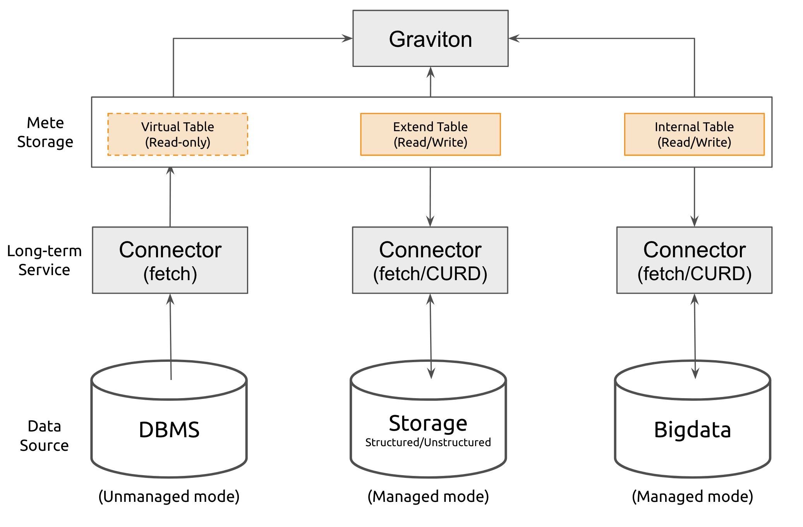

# RFC-2: Metadata Connector Design

## Design Prerequisites

The `Graviton` receives multiple data sources as input, stores associated metadata, 
and outputs this information through a RESTful API to support the Graviton UI.

When designing the Graviton connector, one of the major decisions we had to make was 
whether we would store the metadata we collected metadata ourselves or extract it 
real time upon request.
If we delegate this responsibility to metadata sources, we need all data sources to 
support `high throughput` and `low latency` reads, which introduces complexity and risk.
For example, a query that gets a table schema often takes a few seconds to process, 
making it unsuitable for visualization. Similarly, our Hive metastore manages 
all of Hive's metadata, making it risky to require high throughput read requests. 

Because the Graviton supports so many different data sources of metadata, 
we decided to store the metadata in the Graviton architecture itself. 

In addition, while most use cases require new metadata, they do not need to see 
the metadata change in real time, making periodic collected or extract possible.

We also separate the request service layer from the data source connector layer so that 
each layer runs in a separate process, as shown in below figure:

This isolates the two layers, which reduces collateral impact. 
For example, a metadata data connection job may use a large amount of system resources, 
which may affect the SLA of the api at the request service layer. 

In addition, the data connection layer is less sensitive to outages than the 
Graviton's request service layer, ensuring that outdated metadata will still 
be served if the data connection layer goes down, thus minimizing the impact on users.

## Connectors

Connectors can connect different data source, such as relational databases, file systems 
or WebServices, Execute fetch metadata or CURD operation from them.

### Metadata management mode

`Graviton` supports two kinds of data source management modes:

#### Unmanaged mode
When a user sets a data source in `Graviton` to `Unmanaged` mode,
Connector can only use read-only interface to fetch metadata, and cannot perform Create, Update, and Delete operation.

The underlying data source will be mapped into a `Virtual Table` structure.
Users only through `Graviton` to view metadata, analyze data lineage, query data, and other read-only operations.

#### Managed mode
When a user sets a data source in `Graviton` to `Managed` mode,
Connector can use read/write interface to create, update, read, and delete metadata.

The underlying data source will be mapped into a `Extend Table` or `Internal Table` structure.
Users can use `Graviton` as a complete portal for data. For example, query data, delete data, modify metadata, 
and other read/write data operations.

### Metadata Operation Interface

#### Read-only Interface

+ List&lt;String&gt; getSchemaNames()
+ int getSchemaCount()
+ List&lt;Schema&gt; getSchemas(int pageSize, int offset)
+ Schema getSchema(final String schemaName)
+ List&lt;String&gt; getDatabaseNames()
+ int getDatabaseCount()
+ List&lt;Database&gt; getDatabases(int pageSize, int offset)
+ Database getDatabase(final String dbName)
+ List&lt;String&gt; getTableNames(final String dbName)
+ int getTableCount(final String dbName)
+ List&lt;Table&gt; getTables(final String dbName, int pageSize, int offset)
+ Table getTable(final String dbName, final String tableName)
+ String getTableComment(final String dbName, final String tableName)
+ Map&lt;String, Object&gt; getTableProperties(final String dbName, final String tableName)
+ List&lt;String&gt; getViewNames(final String dbName)
+ int getViewCount(final String dbName)
+ List&lt;Table&gt; getViews(final String dbName, int pageSize, int offset)
+ Table getView(final String dbName, final String viewName)
+ PartitionStatistics getTableStatistics(final String dbName, final String tableName)
+ ColumnStatistics getColumnStatistics(final String dbName, final String tableName, final String colName)

#### Read/Write Interface
+ void alterSchema(final String schemaName, final Schema schema)
+ void dropSchema(final String schemaName)
+ void createDatabase(final Database database)
+ void alterDatabase(final String dbName, final Database database)
+ void dropDatabase(final String dbName)
+ void createTable(final Table table)
+ void alterTable(final String dbName, final String tableName, final Table table)
+ void dropTable(final String dbName, final String tableName)
+ void setTableProperties(final String dbName, final String tableName, Map&lt;String, Optional&lt;Object&gt;&gt; properties)
+ void setTableComment(final String dbName, final String tableName, Optional&lt;String&gt; comment)
+ void addColumn(final String dbName, final String tableName, final Column column)
+ void alterColumn(final String dbName, final String tableName, final String colName, final Column newColumn)
+ void dropColumn(final String dbName, final String tableName, final String colName)
+ void setTableStatistics(String dbName, String tableName, List&lt;ColumnStatistics&gt; statistics)
+ void updateTableStatistics(String dbName, String tableName, Function&lt;PartitionStatistics, PartitionStatistics&gt; update)
+ void dropTableStatistics(String dbName, String tableName)
+ void setColumnStatistics(String dbName, String tableName, String columnName, ColumnStatistics statistics)
+ void updateColumnStatistics(String dbName, String tableName, String columnName, ColumnStatistics colStatistics)
+ void dropColumnStatistics(String dbName, String tableName, String columnName)
+ void setColumnIndexStatistics(String dbName, String tableName, String columnName, ColumnIndexStatistics statistics)
+ void updateColumnIndexStatistics(String dbName, String tableName, String columnName, ColumnIndexStatistics colStatistics)
+ void dropColumnIndexStatistics(String dbName, String tableName, String columnName)

Note that there are parts of the metadata that do not have interface.
+ Partition: Since the number of the partitions can often by very large, it's difficult for us to keep track
of change to partition, which would put a lot of pressure on `Graviton`. So instead of saving partition information 
to `Graviton` Storage, we use a real-time operation for read, modify, and delete.
+ Role and Privileges: `Graviton` will have its own permission system in the future, so it is not available at this time.
+ lock, transaction, and token: These future are not supported at this time.

#### Metadata multiple version

When the connector discovers that the metadata has changed, The connector will create a new version and timestamp
of the metadata.
This allow us to track the history of metadata changes and store all historical metadata information.
Use can view and rollback to any version of metadata.

### Typical Connectors
`Graviton` prioritize implement very high usage and important connector.

#### Hive Connector
HMS(hive metastore) manages many big data systems' metadata. like., hive, impala, spark etc. 

#### JDBC Connector
Base class of JDBC interface database connector, them normal is relationship database or partial KV database.
JDBCConnector support commonly used metadata operation, We can extend specific metadata manipulation capabilities 
based on the different databases.

#### File Connector
Many files are stored in the file storage system (HDFS), Object storage system(S3, OZone), 
or data lake(IceBerg, Hudi, DeltaLake), FileConnector support many kinds of file format's metadata operation, 
like., Parquet, AVRO, CSV etc.

#### Data Source Connector Classification
| Connector Type | Data sources / Analysis Engine            | Description                     |
|----------------|-------------------------------------------|---------------------------------|
| HiveConnector  | Hive, Impala, Spark, etc.                 |  |
| JDBCConnector  | Redshift, Mysql, Oralce, Clickhouse, etc. |  |
| FileConnector  | S3, Iceberg, Hudi, DeltaLake, etc.        | Parquet, AVRO, CSV file format. |

### Connector Factory

Instances of the connector are created by the `ConnectorFactory`, The Factory creates its
own connector for each different dada source, The connector factory is responsible for creating
an instance of a connector object based on the `create` function:  
`Connector create(String lakehouse, String tenant, String zone, Map<String, String> config, ConnectorContext context)`.

### Connector service

In the unmanaged mode, the connector can use period schedule job,
but in the managed mode, the connector need to run for a long time to support interactive CURD operation.
So, the connector unified to use the long-term service run mode.

#### Connector service recover

`Graviton` stores connector configure information in the database, 
and when the connector is restarted, the connector can be restored to its previous stats of operation
based on the configure information in the database.

#### Environment isolation

Because each connector plug-in will contain many dependent JAR packages that easy cause conflicts,
We need to have the plug-in run in an isolation environment.
So we need store each plug-in and its associated dependency packages in a separate directory.
All JAR packages in this directory and dynamical loaded through `ClassLoader` function using java reflate mechanism.

In additionally, packages dependency isolation's functionality also to better supported for running in cloud environment.
Each plug-in can be stand-alone deployment independence in the kubernetes pod container, Allow each data source 
connector scala different as needed.
