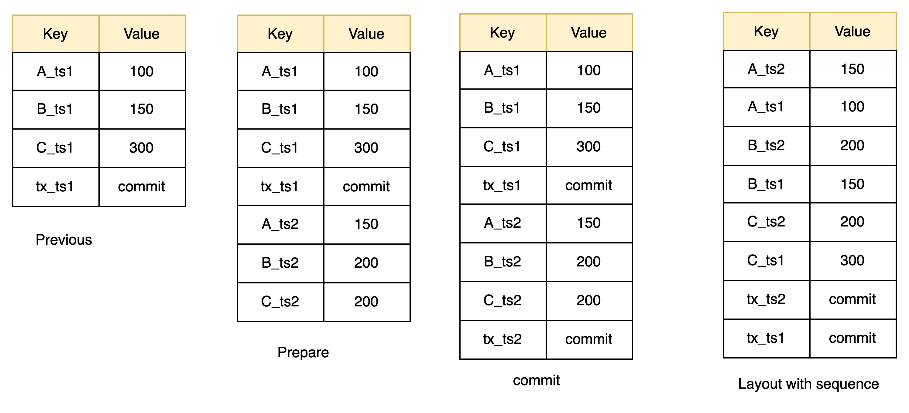

<!--
  Licensed to the Apache Software Foundation (ASF) under one
  or more contributor license agreements.  See the NOTICE file
  distributed with this work for additional information
  regarding copyright ownership.  The ASF licenses this file
  to you under the Apache License, Version 2.0 (the
  "License"); you may not use this file except in compliance
  with the License.  You may obtain a copy of the License at

   http://www.apache.org/licenses/LICENSE-2.0

  Unless required by applicable law or agreed to in writing,
  software distributed under the License is distributed on an
  "AS IS" BASIS, WITHOUT WARRANTIES OR CONDITIONS OF ANY
  KIND, either express or implied.  See the License for the
  specific language governing permissions and limitations
  under the License.
-->

# RFC-1: Design of transaction mechanism on key-value store (removed)

| Revision | Owner | Date       |
| :------- |-------|------------|
| v0.1     | Qi Yu | 21/11/2023 |

## ❌️ REMOVED

Removed KV store on: 2024-12

This document is no longer maintained and may contain outdated information.

## Background

Currently, our storage layer heavily relies on the transaction mechanism provided by key-value storage backend such as RocksDB to ensure reliability. However, some key-value pair databases do not support transaction operations, making it challenging for Apache Gravitino to adapt to other KV databases such as Redis, Cassandra, Hbase, and so on.

To make gravitino adapt different key-value stores, we need to eliminate transactional dependency and come up with alternative solutions.

## Goal

1. Support transaction operations on key-value store
2. Do not make too much change to the current storage layer
3. Easy to implement and maintain.

## Design

Based on [previous design](../rfc-2/Entity-key-encoding-for-kv-store.md), to support transaction, we use MVCC to implement transaction mechanism. The main idea is to add a version number to each key-value pair. When a transaction is committed, we will update the version number of the key-value pair. When a transaction is aborted, we will delete the key-value pair.
The following figure shows the design of transaction mechanism.



Note:
1. A, B, C, is the original keys
2. ts1, ts2, ts3 are the timestamp of the transaction
3. tx_ts1, tx_ts2, tx_ts3 are commit marks.

Take the above figure as an example, the transaction is as follows:
Assuming we want to update three key-values pairs:
1. Change the value of Key A from 100 to 150
2. Change the value of Key B from 150 to 200
3. Change the value of Key C from 300 to 200

The transaction process is as follows:

**Prepare stage**
1. First, we will get a TSO(Timestamp oracle) named ts2 as the transaction id.
2. Then we will read old values of A, B, C using the TSO ts2.
3. Update the value of A, B, C to 150, 200, 200 respectively.
4. Then we will add a version number to each key-value pair, the version number is the transaction id.
5. Then we will write the new key-value pairs to the storage layer.

**Commit stage**
We would construct the commit mark tx_ts2 and save it to the storage layer. The value of tx_ts2 contains
all keys in the transaction.

**Rollback stage**
If any steps in prepare stage or commit stage fails, we will roll back the transaction. In fact, we
need to do nothing to roll back the transaction. Because we have added a version number to each key-value pair and
those keys in the failed transaction will not be visible to users.


## Detail implementation

### Write process

Assuming we want to put key-value pairs 'key1:value1' and 'key2:value2' to the storage layer. The tso we get is 1, The process is as follows:

In prepare stage, we will put the following keys into the storage layer:
```
KEY: 0x6B657931 1F FFFFFFFFFFFFFFFE  ---> VALUE: 0x00000000 00000000 76616C756531
KEY: 0x6B657932 1F FFFFFFFFFFFFFFFE  ---> VALUE: 0x00000000 00000000 76616C756532
```
- `6B657931`: the hex of 'key1'
- `1F`: we use `1F` space as the separator of key and TSO.
- `FFFFFFFFFFFFFFFE`: Represent tso 1. Note, we use 8 bytes to represent tso. How to convert 1 to `FFFFFFFFFFFFFFFE`? First we convert 1 to 0x0000000000000001, then we use `^` 0xFF to get the complement of 0x0000000000000001, then we get 0xFFFFFFFFFFFFFFFE.
  Why we need to do So? we want to make sure that the key-value pair with the same key and different tso can be sorted in descending order. that is: if tso1 >= tso2, then binary(tso1) <= binary(tso2).
- `00000000 00000000 76616C756531`: the hex format of 'value1'. The first byte `0x00` means is put operation, if the value is '0x01', it marks the key-value pair has been deleted.

In the commit stage, we will put the following keys into the storage layer:
```
KEY: 0x1E 1F FFFFFFFFFFFFFFFE  ---> VALUE: keys of the transaction involved. 
```
- `1E`: prefix of transaction commit mark
- `1F`: separator
- `FFFFFFFFFFFFFFFE`: Represent tso 1. Note, we use 8 bytes to represent tso. How to convert 1 to `FFFFFFFFFFFFFFFE`? First we convert 1 to 0x0000000000000001, then we use `^` 0xFF to get the complement of 0x0000000000000001, then we get 0xFFFFFFFFFFFFFFFE.

### Read process

Assuming we have the following key-value pairs in storage layer:
```
KEY: 0x6B657931 1F FFFFFFFFFFFFFFFD  ---> VALUE: 0x00000000 00000000 76616C756532
KEY: 0x6B657931 1F FFFFFFFFFFFFFFFE  ---> VALUE: 0x00000000 00000000 76616C756531
KEY: 0x1E 1F FFFFFFFFFFFFFFFD        ---> VALUE: keys of the transaction involved. 
KEY: 0x1E 1F FFFFFFFFFFFFFFFE        ---> VALUE: keys of the transaction involved. 
```
If we want to get the value of key1, the process is as follows:
1. First, we will get a TSO(Timestamp oracle) 3 as the transaction id.
2. Construct the start key to scan the storage layer: `0x6B657931 1F FFFFFFFFFFFFFFFC`
3. Find the first key that with prefix `0x6B657931` and greater than start key `0x6B657931 1F FFFFFFFFFFFFFFFC`, we will get `0x6B657931 1F FFFFFFFFFFFFFFFD`
4. If there exists the key `0x1E 1F FFFFFFFFFFFFFFFE`, means the transaction is committed, then we will get the value of key1 from `0x6B657931 1F FFFFFFFFFFFFFFFD`.
5. or repeat steps 3
6. If the value of key `0x6B657931 1F FFFFFFFFFFFFFFFD` starts will `0x00`, then we will get the value of key1 from `0x6B657931 1F FFFFFFFFFFFFFFFD`. if the value of key `0x6B657931 1F FFFFFFFFFFFFFFFD` starts will `0x01`, it means this key-value pair has been removed, so we return null.

### Delete process
Delete steps are almost the same as that of write process except that the prefix of it is `0x01` instead of `0x00`.

Put key 'test1':
```
KEY: 0x6B657931 1F FFFFFFFFFFFFFFFE  ---> VALUE: 0x00000000 00000000 76616C756531
```

Delete key 'test1':
```
KEY: 0x6B657931 1F FFFFFFFFFFFFFFFE  ---> VALUE: 0x01000000 00000000 76616C756531
```

### Scan and range query process
Scan and range query are almost the same as that of read process, for more detailed information, please see related implementation `TransactionalKvBackendImpl`.

## Key format after this modification

- Keys that start with 0x'1D0000' store the contents of id-name mapping. for more please refer to class `KvNameMappingService`.
- Keys that start with 0x'1D0001' store the data of current timestamp which is used for generating transaction id, for more please refer to class `TransactionIdGeneratorImpl`.
- Keys that start with 0x'1D0002' store the information of storage layout version. For more please refer to `KvEntityStore#initStorageVersionInfo`
- Keys that start with 0x'1D0003' store tha transaction id that was used by `KvGarbageCollector` last time.
- Keys that start with 0x'1E' store transaction marks which mark the transaction is committed or not.
- Other key spaces are used to store gravitino entities like `metalakes`,`catalogs`, `scheams`, `tables` and so on. it usually starts with from 0x'20'(space) to 0x'7F'(delete). For more please refer to class `KvEntityStoreImpl`.
